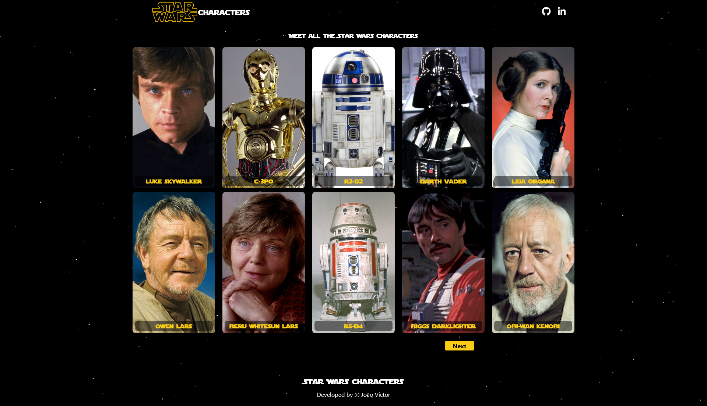

# Star Wars Characters

This project is a website that provides information about the characters in the Star Wars franchise with images and names of the characters on cards and a modal showing weight, height, eye color and birth year. Using the [Swapi] api(https://swapi.dev)

[Access the project here](https://joaovictorgi.github.io/Star-Wars-Characters/)
## Technologies

## Contribute
1. **Clone project**: `git clone https://github.com/JoaoVictorGI/Star-Wars-Characters.git`
2. **Create feature/branch**: `git checkout -b feature/NAME`

## License

This software is available under the following licenses:

- [GPLv3](https://www.gnu.org/licenses/gpl-3.0.html)